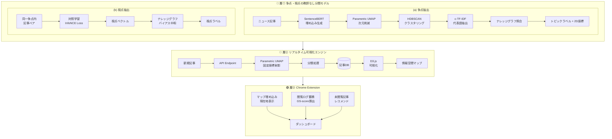
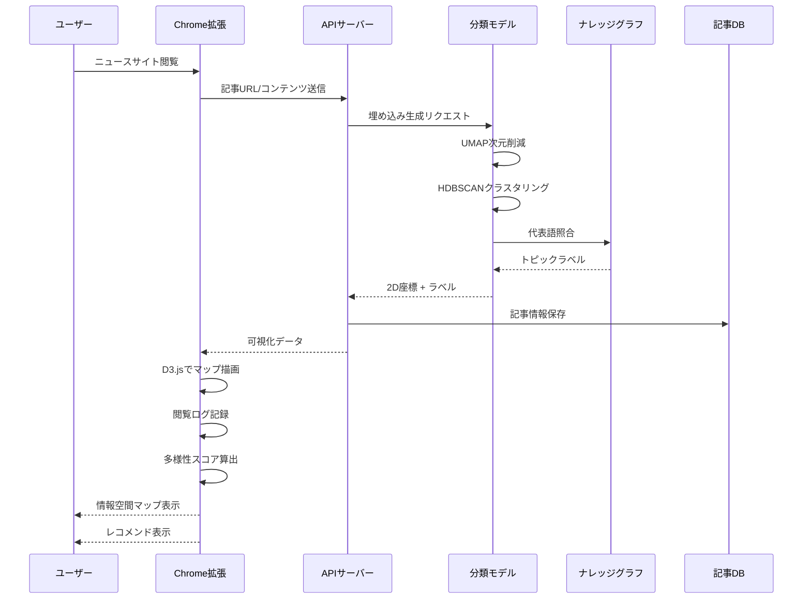
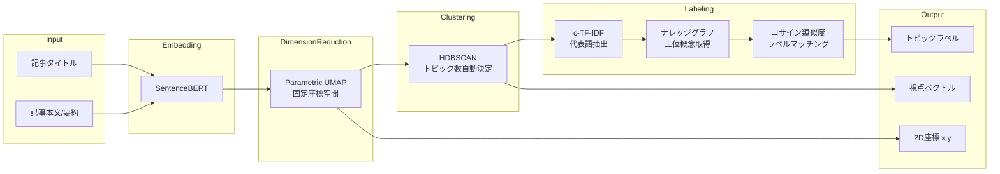

# InfoMap システムアーキテクチャ

## 全体構成図

## 技術スタック

| レイヤー | 技術 |
|---------|------|
| 層① 分類モデル | Python, BERTopic, SentenceBERT, Parametric UMAP, HDBSCAN, PyTorch |
| 層② 可視化エンジン | FastAPI/Flask, D3.js, PostgreSQL/Redis |
| 層③ Chrome拡張 | TypeScript, Chrome Extension API, D3.js, IndexedDB |

## データフロー

## 争点・視点抽出の詳細

